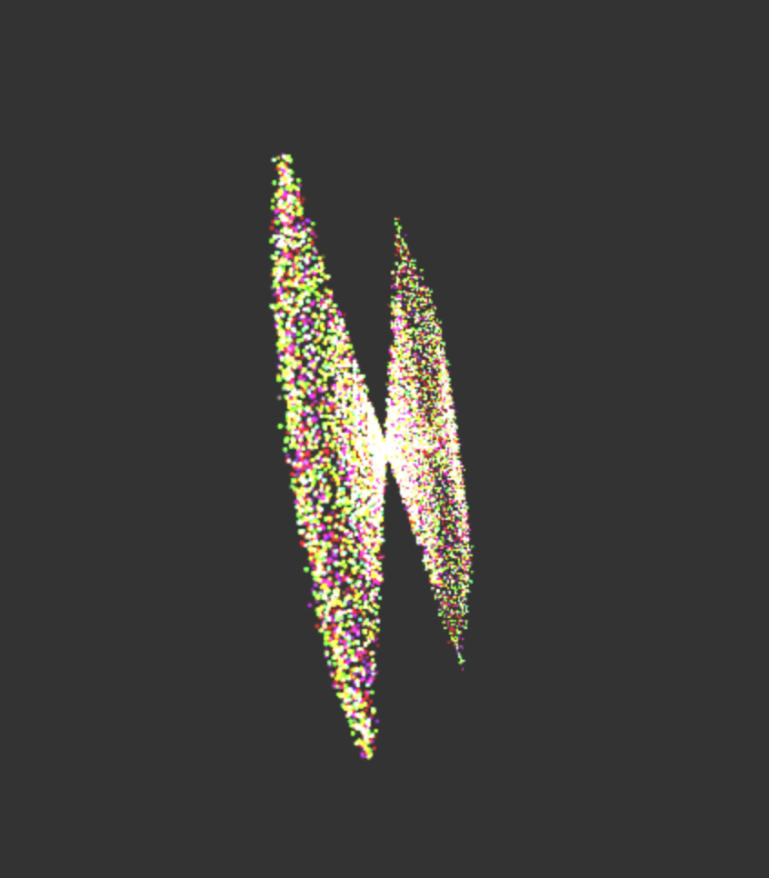

# Project 6: Particle System

https://chloesnyder.github.io/homework-6-particle-system-chloesnyder/

Known issues:
- attraction and repulsion works, but not tuned well. Overshoots
- Mesh attraction does not work. I can see that the particles are being attracted in some direction, but there's something off. Currently what I'm trying to do is just have the particles go to each of the vertices, but there must be something off about how I'm accessing the vertices.
- Raycasting is off, it's off set weirdly (displayed by blue particle). I've been unable to determine why.

Basically, this doesn't work. I am using a verlet integrator, and I think I need to tune my paratemrs better but I'm having difficulty determining good numbers. You can tell basic attraction and repulsion works, but the simulation explodes. I tried using an euler integrator as well but that's also broken.

To use:
- Press A to attract to a point
- Press R to repel from a point
- Press M to toggle if pressing down = raycast a new attractor/repulsion point. M is inititially false. When M is false, you can press the GUI to get mesh attractor.
- Click to create a single attractor point. There is only one attractor point with the mouse
- Color is determined by cosine function and particle distance to attractor/repulsor point

Screen shots:

